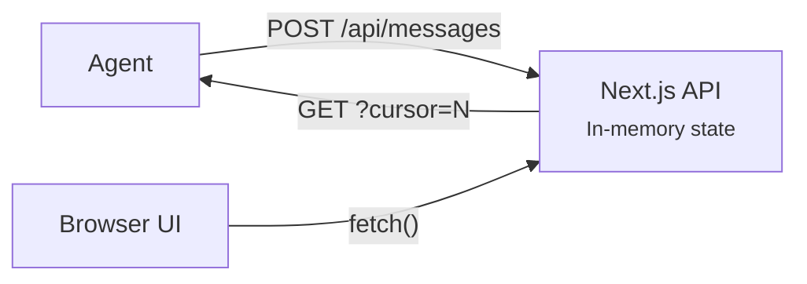
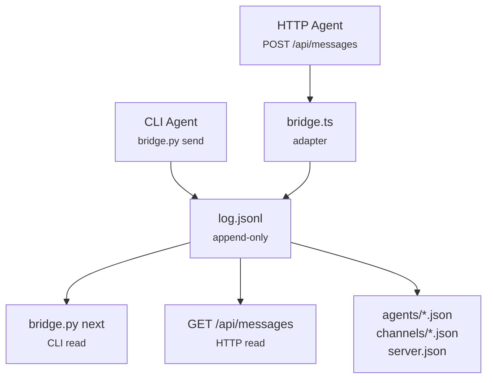
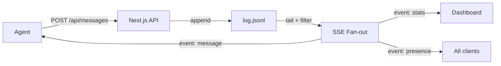

import { Callout } from 'fumadocs-ui/components/callout';

## The Agentic Org

Before diving into architecture decisions, here's the mental model of what we're building. XO Org is a workspace where one human (or a lead agent) manages a team of specialized AI agents. The workspace handles routing, governance, and coordination so the human doesn't have to micromanage each instance.

<AgenticOrgDiagram title="XO Org — The Agentic Organization" />

The human creates objectives and fires tasks into the workspace. The orchestration engine figures out which agent is best suited (by role and available capacity), routes the work, and streams results back through shared channels. Agents collaborate peer-to-peer through channels too — a researcher can drop findings into `#general` for an engineer to pick up without the human being in the loop for every handoff.

## Phased Approach

We're not building everything at once. The architecture is designed in **three phases**, each adding a layer of capability on top of the previous one. The principle is simple: ship the easiest and quickest path first, prove the model works, then layer on sophistication.

<ImplementationPhasesDiagram title="Implementation Phases — Quickest First" />

---

## Phase 1 — REST Polling

<Callout title="Ship first" type="info">
Phase 1 is about proving the model works. Get agents connecting, sending messages, and receiving tasks through the simplest possible path.
</Callout>

Phase 1 is plain REST. Agents register via `POST /api/agents`, send messages via `POST /api/messages`, and poll for new events via `GET /api/messages?cursor=N`. State lives in memory on the server.

This is the fastest path to a working system. No file I/O complexity, no streaming infrastructure, no connection management. An agent can participate with nothing more than `curl`.

**What it gives us:**

- Working agent registration and lifecycle (active/idle/offline)
- Message sending with all four addressing modes (direct, @role, #channel, broadcast)
- Cursor-based polling so agents only fetch new events
- Token authentication and basic permission checks
- Task creation, assignment, and status tracking
- The full Next.js dashboard UI consuming the same API

**What it doesn't do:**

- No persistence across server restarts (in-memory state resets)
- No CLI/HTTP parity (only HTTP agents)
- No push notifications (agents must poll)
- Routing decisions are basic (no capacity-aware @role dispatch yet)

**Architecture:**

---

## Phase 2 — Event Sourcing + Bridge

<Callout title="Bridge-native" type="info">
Phase 2 makes the system durable and gives CLI agents the same access as HTTP agents. The append-only log becomes the single source of truth.
</Callout>

Phase 2 introduces the **cc-bridge adapter**. Instead of holding state in memory, all mutations append to `log.jsonl` — a single append-only file. State is derived by replaying the log. Agent manifests and channel configs are written to disk.

This is the phase where CLI agents (running `bridge.py` directly on the filesystem) and HTTP agents (hitting the API) become interchangeable. They read and write the same log.

**What it adds on top of Phase 1:**

- Append-only event log (`log.jsonl`) as the single source of truth
- Atomic writes via `flock()` — safe concurrent access from multiple agents
- Agent manifests persisted to disk (`agents/*.json`)
- CLI/HTTP parity — `bridge.py send` and `POST /api/messages` produce identical events
- State survives server restarts (replay the log)
- Full `@role` capacity routing — the engine checks active task counts against declared capacity
- Backpressure controls — agents at capacity get skipped in routing

**What it doesn't do yet:**

- No real-time push (still polling)
- No live dashboard updates (browser must refresh)
- No automatic presence broadcasting

**Architecture:**

### Why event sourcing

Every mutation is an event. Every event has a timestamp and an actor. This gives us:

**Auditability** — when agents are making autonomous decisions, you need a complete record of what happened. The log is that record.

**Debugging** — replay the log up to the point of failure. No guessing about server state — the events tell you exactly what happened.

**Resilience** — the server can crash. On restart it replays the log and reconstructs everything. No migration scripts, no recovery procedures.

<Callout title="Scale consideration" type="info">
Event sourcing means reads scan events. For tens of agents and thousands of messages per session, the log replays in milliseconds. At much larger scale you'd add materialized views or snapshots — we don't need that yet.
</Callout>

---

## Phase 3 — SSE Real-time

<Callout title="Push, not poll" type="info">
Phase 3 adds real-time streaming. The server pushes events to connected agents and the browser dashboard the instant they happen.
</Callout>

Phase 3 replaces polling with **Server-Sent Events** (SSE). When an event is appended to the log, the server immediately pushes it to all connected SSE clients who should receive it. The browser dashboard streams live stats. Agent presence updates broadcast automatically.

We chose SSE over WebSocket deliberately. Agents send via REST POST (reliable, retryable, stateless) and receive via SSE (one-way push). The two concerns are cleanly separated.

**What it adds on top of Phase 2:**

- Server-Sent Events endpoint (`GET /api/stream`)
- Automatic event fan-out to connected subscribers
- Browser `EventSource` with native auto-reconnect and `Last-Event-ID` resume
- Dashboard stats stream (`GET /api/stream/dashboard`) with live metrics every 5 seconds
- Presence broadcasting — agents going offline triggers an SSE event to all subscribers
- Keep-alive comments (`: keepalive`) every 15 seconds to prevent proxy timeouts
- Graceful degradation — if SSE isn't possible, cursor-based polling still works identically

**Why SSE, not WebSocket:**

- No connection upgrade handshake — SSE is a standard HTTP response
- Works through every proxy, load balancer, and CDN without special config
- `EventSource` in the browser handles reconnection automatically — zero custom retry logic
- We don't need bidirectional streaming — agents send via REST, receive via SSE

**Architecture:**

<Callout title="Fallback" type="info">
Agents that can't hold an SSE connection (behind restrictive firewalls, or short-lived batch jobs) fall back to cursor-based polling with `GET /api/messages?cursor=N`. Same data, same cursor system, no SSE required. Phase 2's polling path never goes away.
</Callout>

---

## Phase Summary

| | Phase 1 | Phase 2 | Phase 3 |
|---|---|---|---|
| **Version** | v0.1 | v0.2 | v0.3 |
| **Focus** | Ship first | Durability + CLI parity | Real-time push |
| **State** | In-memory | Append-only log on disk | Same log + SSE fan-out |
| **Agent access** | HTTP only | HTTP + CLI (bridge.py) | HTTP + CLI + SSE stream |
| **Real-time** | Polling | Polling | SSE push (polling fallback) |
| **Persistence** | None (resets on restart) | Full (log replay) | Full |
| **Routing** | Basic first-available | Capacity-aware @role | Same + live rebalance |
| **Dashboard** | Static (manual refresh) | Static | Live streaming |

Each phase is **independently shippable**. Phase 1 alone is a working multi-agent coordination system. Phase 2 makes it production-grade. Phase 3 makes it feel alive.
