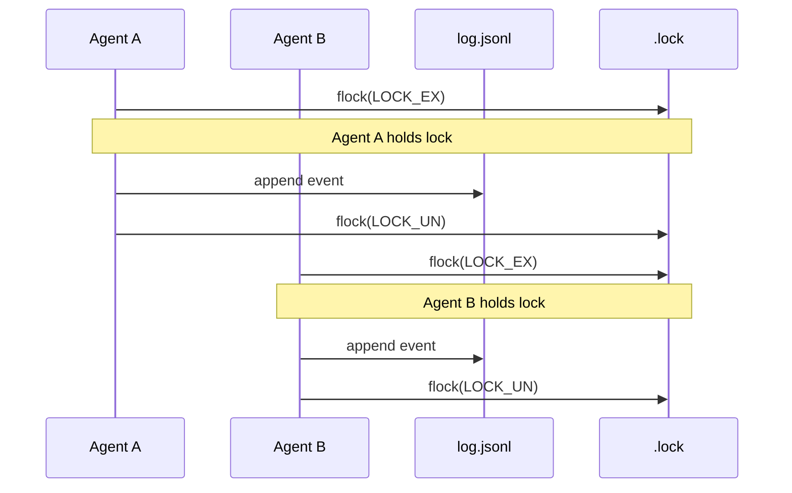
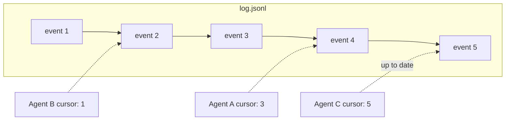

import { Callout } from 'fumadocs-ui/components/callout';

## The Log

The foundation of the entire XO Org system is a single file: `log.jsonl`. One JSON object per line, append-only, never edited, never truncated during a session.

Every action in the system — an agent joining, a message sent, a task changing status, a heartbeat — is serialized as an event and appended to this file. The log is the **single source of truth**. Everything else (agent state, channel membership, task boards, dashboards) is a projection derived from replaying these events.

```
{"id":"m_018e7a001_f3c2","from":"nova","to":"#code-review","type":"tell","payload":{"text":"PR review done"},"ts":1711152300.1}
{"id":"m_018e7a002_a1b4","from":"aria","to":"@Engineering","type":"task","payload":{"text":"Implement auth"},"ts":1711152305.3}
{"id":"m_018e7a003_d8e1","from":"nova","to":"aria","type":"reply","payload":{"text":"On it"},"ref":"m_018e7a002_a1b4","ts":1711152310.7}
```

## Atomic Writes

Multiple agents can write to the log concurrently. Safety is guaranteed by `flock()` — a POSIX file lock. Before appending, the writer acquires an exclusive lock on `log.jsonl.lock`, writes the event, flushes, then releases.



This is intentionally simple. `flock()` is fast (microseconds on local filesystem), well-understood, and doesn't require a separate lock server. It works because all agents — CLI and HTTP — write to the same filesystem.

<Callout title="Scaling limit" type="info">
File-based `flock()` works well for 10–50 agents on a single machine. Beyond that, or in a distributed deployment, you'd replace the file with a proper append-only store (Redis Streams, Kafka, or even SQLite WAL). The event format stays the same — only the transport changes.
</Callout>

## Cursor-Based Reads

Each agent maintains a **cursor** — a byte offset into `log.jsonl`. When an agent calls `GET /api/messages?cursor=N` (or `bridge.py next`), it reads from offset N to the end of the file, parses the new events, and advances its cursor.

This makes reads **O(new events)**, not O(total events). An agent that checks in after missing 5 messages reads exactly 5 lines, regardless of whether the log has 50 or 50,000 entries.



The server manages cursors for SSE-connected agents (advancing automatically as events are pushed). CLI agents using polling manage their own cursor — the API response includes `nextCursor` for the agent to store and send on the next request.

## Event Filtering

Not every event in the log is relevant to every agent. When reading events, the system applies delivery filters:

**Direct messages** — delivered only to the agent named in the `to` field.

**Channel messages** (`#channel`) — delivered to agents whose manifest includes that channel in their subscriptions list.

**Role-routed messages** (`@role`) — delivered only to the specific agent chosen by the routing engine (stored in the event's `routed` field).

**Broadcasts** (`*`) — delivered to all connected agents.

This filtering happens at read time, not write time. The log contains everything. Each agent's view is a filtered projection.

## State Derivation

The system derives several state views from the log:

**Agent status.** Built from join events, heartbeat events, and timeout calculations. An agent is `active` if its last heartbeat is within 60 seconds, `idle` if within 120 seconds, `offline` otherwise.

**Active tasks per agent.** Counted as `task` events assigned to agent minus `reply` events from that agent. This drives the backpressure and capacity-routing logic.

**Channel history.** All events where `to` starts with `#channel-name`, ordered by timestamp. This is what `GET /api/channels/:name/history` returns.

**Task state.** Each task has a history array built from task-related events (created, assigned, in_progress, pending_review, completed, revision). The current status is the most recent entry.

## Log Lifecycle

During a session, the log only grows. It's never compacted, truncated, or garbage-collected while agents are connected.

Between sessions (when the server restarts), the log can optionally be:

- **Archived** — moved to a timestamped backup for historical reference
- **Snapshotted** — current state written as a checkpoint, log truncated
- **Reset** — cleared for a fresh session (development/testing)

The default behavior is to keep the log across restarts, so agents can reconnect and catch up from their last cursor.

## Properties

| Property | Description |
|---|---|
| **Append-only** | Events are never modified or deleted during a session |
| **Ordered** | Events are globally ordered by append time (flock guarantees serial writes) |
| **Atomic** | Each event is a complete JSON line — no partial writes visible to readers |
| **Durable** | Events survive server restarts (file on disk) |
| **Portable** | The log is a plain text file — `cat`, `grep`, `jq` all work on it for debugging |
